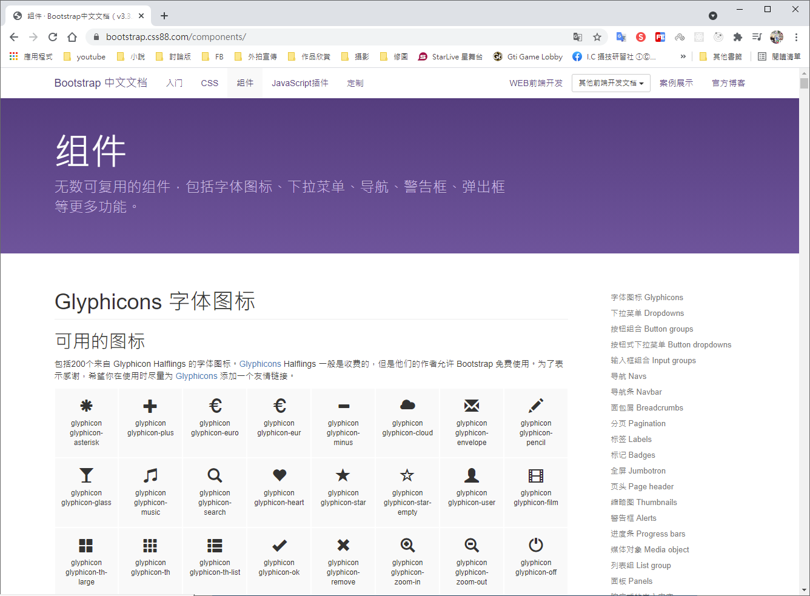
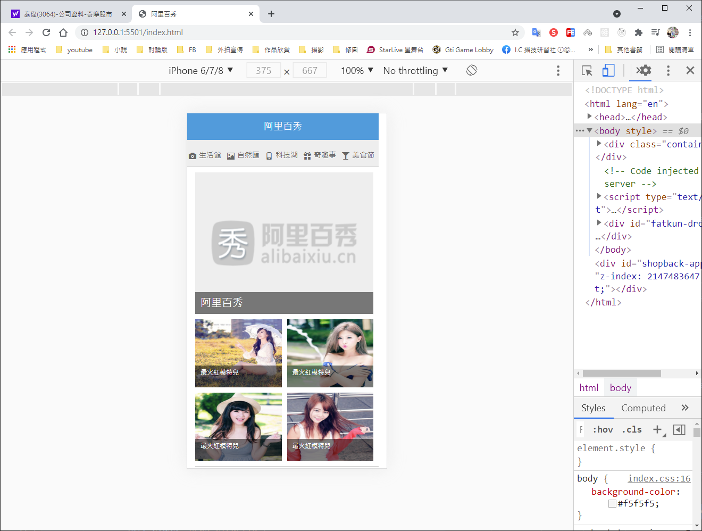
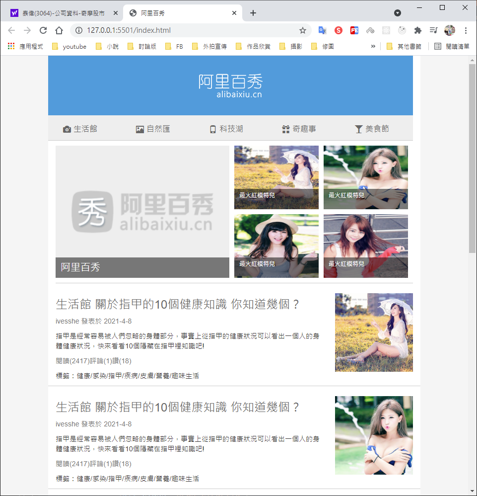
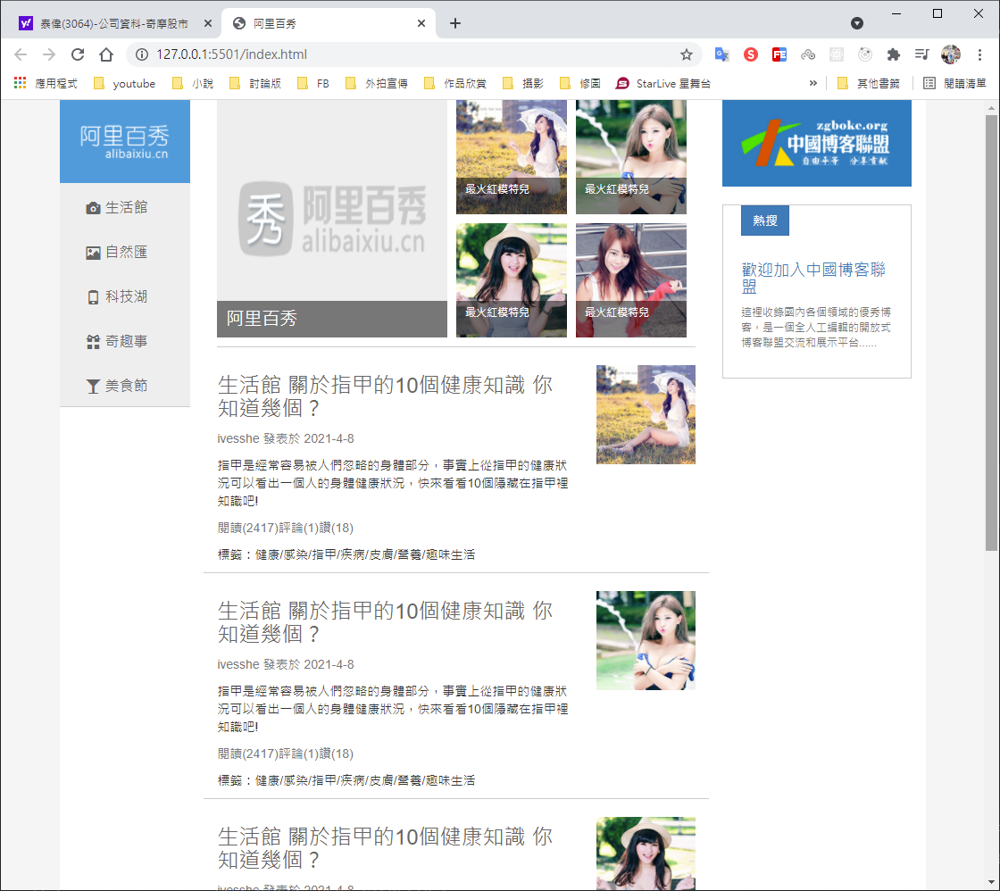
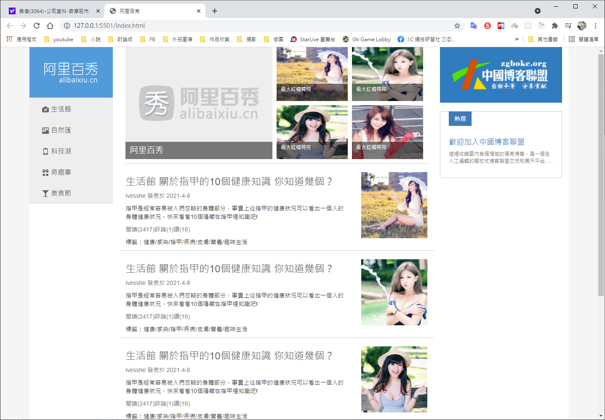

# HTML CSS Bootstrap 阿里百秀 首頁製作

# Github展示

本網頁為學習使用，若有侵權請告知，謝謝！

https://ivesshe.github.io/HTML_CSS_Bootstrap_Alibaixiu/

# 配置

- 方案： 採取響應式頁面開發方案
- 技術∶ Bootstrap框架
- 設計圖： 採用1280px設計尺寸

# 螢幕劃分分析

- 螢幕縮放發現 中螢幕和大螢幕布局是一致的，因為列定義為col-md- 就可以了，md是>=970以上的
- 螢幕縮放發現 小螢幕布局發生變化，因此需要為小螢幕根據需求改變布局
- 螢幕縮放發現 超小螢幕布局又發生變化，因此需要為超小螢幕根據需求改變布局
- 策略： 先布局md以上的pc端布局，最後根據實際需求再修改小螢幕和超小螢幕的特殊布局樣式

# Bootstrap使用

1. 創建文件夾結構
2. 創建html骨架結構
3. 引入相關樣式文件
4. 書寫內容

# Bootstrap組件

https://bootstrap.css88.com/components/

# 移動式布局總結

## 移動端主流方案

1. 單獨製作移動端頁面(主流)
2. 響應式頁面兼容移動端(其次)

## 移動端技術選擇

- 流式布局(百分比布局)
- flex彈性布局(推薦)
- rem適配布局(推薦)
- 響應式布局

# 完成畫面 - 各種版型

## 由小到大

